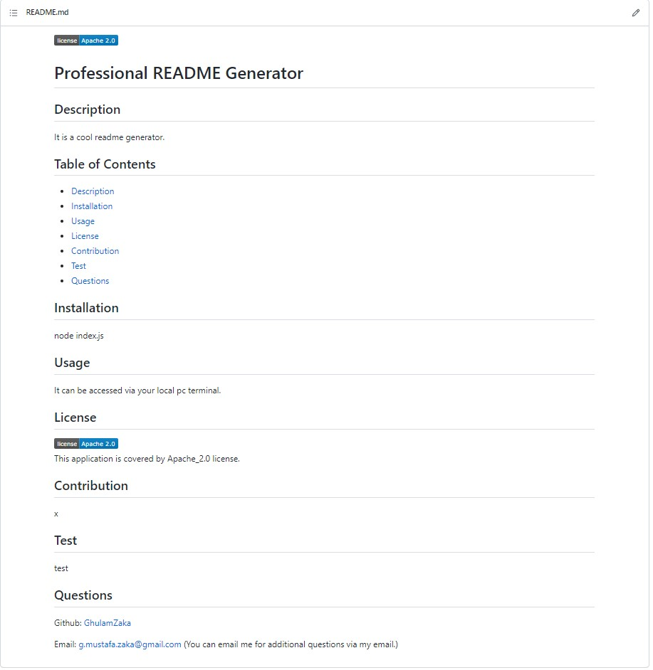

# Professional README Generator

## Description

- This README generator is able to quickly create a professional README for your projects.
- It works with the command line and prompts questions for the project title, description, installation instructions, usage information, contribution guidelines, and test instructions.
- It also allows users to select license from the options provide there and display in the README file.
- It also consists of table of contents which enable users to navigate through each section easily.
  -IT can be started by opening your local PC terminal and entering node index.jx

## Github Repository URL:

https://github.com/GhulamZaka/professional-readme

## Walkthrough Vedio

https://drive.google.com/file/d/1n4K0ZH8HrN-ctuOJIyLgByMIqLsKT0ut/view?usp=sharing

## ScreenShot

